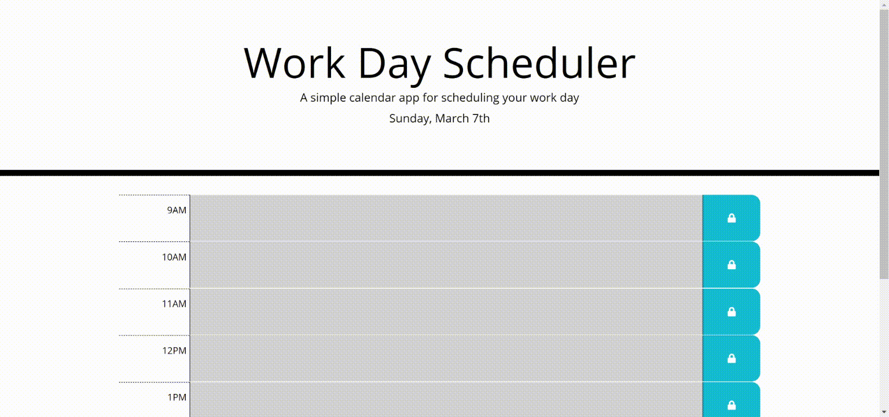

# WantADog

[WantADog](https://abnertor.github.io/WantADog/) is a library of doggo pictures and random names to help users find the best doggo-doggo name combinations.

## Usage

Click the "Name" button to get a new doggo name.

Click the "Doggo" button to get a new doggo image.

Click the "New Combo" button to get a new combination of these.

Click the "Save Current Combo" button to add the current doggo name/image combination to Favorites.

Browse Favorites by clicking the "Prev" and "Next" buttons.

Click the "Clear" button to clear previously saved favorites.

## Credits

<b>APIs</b>
* [The Dog API](https://thedogapi.com/): Used to return randomized dog image URLs
  - API key: 774092c9-0b11-4331-9432-a0aac1f1ca4a
* [Namey!](https://namey.muffinlabs.com/): Used to return random names the from US Census Bureau database 

<b>Images</b>
* [Background image](https://longwallpapers.com/doge-wallpaper-high-quality/doge-wallpaper-high-quality-for-desktop-wallpaper/)
* [Favorites doge gif](https://classical-doge.tumblr.com/)
* [Doge favicon](https://www.favicon.cc/?action=icon&file_id=671697)

## License

MIT License

Copyright (c) 2021 [Jackie Alvarez](https://github.com/jaque-leen), [Elise Daly](https://github.com/elisesamanthadaly), [Suejin Kim](https://github.com/suejinkim20), [Abner Toribio](https://github.com/AbnerTor)

Permission is hereby granted, free of charge, to any person obtaining a copy
of this software and associated documentation files (the "Software"), to deal
in the Software without restriction, including without limitation the rights
to use, copy, modify, merge, publish, distribute, sublicense, and/or sell
copies of the Software, and to permit persons to whom the Software is
furnished to do so, subject to the following conditions:

The above copyright notice and this permission notice shall be included in all
copies or substantial portions of the Software.

THE SOFTWARE IS PROVIDED "AS IS", WITHOUT WARRANTY OF ANY KIND, EXPRESS OR
IMPLIED, INCLUDING BUT NOT LIMITED TO THE WARRANTIES OF MERCHANTABILITY,
FITNESS FOR A PARTICULAR PURPOSE AND NONINFRINGEMENT. IN NO EVENT SHALL THE
AUTHORS OR COPYRIGHT HOLDERS BE LIABLE FOR ANY CLAIM, DAMAGES OR OTHER
LIABILITY, WHETHER IN AN ACTION OF CONTRACT, TORT OR OTHERWISE, ARISING FROM,
OUT OF OR IN CONNECTION WITH THE SOFTWARE OR THE USE OR OTHER DEALINGS IN THE
SOFTWARE.